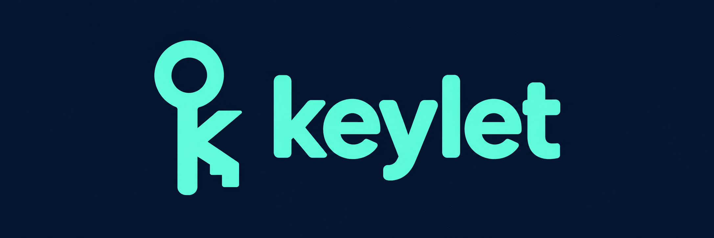

# keylet



Unattended Git commit signing and SSH pushes for AI agents, without exposing raw private keys.

Keylet is a command-line SSH agent for Apple Silicon Macs. It keeps private keys in the Secure Enclave so AI agents can sign commits and push code through Git and OpenSSH without handling the keys themselves.

## Table of Contents

- [Security](#security)
- [Background](#background)
- [Install](#install)
- [Usage](#usage)
- [Development](#development)
- [Maintainers](#maintainers)
- [Acknowledgements](#acknowledgements)
- [Contributing](#contributing)
- [License](#license)

## Security

Any process running as your user can request signatures from the active agent. Keep its socket local; do not forward it to other machines.

Keylet supports signing while the screen is locked with the `after-first-unlock` policy. You must log in at least once after each reboot and keep the agent running.

## Background

AI agents need to sign commits and authenticate Git pushes without waiting for approval at every step. Giving them a private key also lets them copy it. Keylet lets them use a key that stays on your Mac.

- **Keep private keys private.** Keys are created in the Secure Enclave and cannot be read or exported. They cannot be backed up or transferred to another Mac; create a new key when you change machines.
- **Work unattended.** Choose a key policy that allows signing without an authentication prompt, then connect your AI agent to Keylet through Git and SSH.
- **Review key use.** Inspect signing history from the command line.

## Install

### Dependencies

Requires an Apple Silicon Mac, macOS 26.4 or later, and [Homebrew](https://brew.sh/).

```sh
brew install NikitaKurpas/tap/keylet
keylet doctor
keylet version
```

Doctor checks hardware and signing metadata without using keys. Credential access, provisioning and security policy enforcement are reported as not checked.

## Usage

### CLI

Create a key, then list its UUID:

```sh
keylet keys create --label 'Git signing' --policy after-first-unlock
keylet keys list
```

Choose `after-first-unlock` for unattended use after the first login following a reboot, or `when-unlocked` to require an unlocked session. The agent refuses keys with the `user-presence` policy. Key labels and policies are permanent.

Replace `KEY_UUID` below with your key's UUID. Export its public key and start Keylet now and at login:

```sh
mkdir -p ~/.ssh
keylet keys public --id KEY_UUID > ~/.ssh/keylet.pub
brew services start keylet
```

The service serves all unattended keys. To run in the foreground, use `keylet agent`; restrict it to one key with `keylet agent --key KEY_UUID`.

### Delete a key

List keys to find the UUID, preview deletion, then repeat the UUID to confirm:

```sh
keylet keys list
keylet keys delete --id KEY_UUID --dry-run
keylet keys delete --id KEY_UUID --confirm-id KEY_UUID
```

Deletion is permanent; Secure Enclave keys cannot be backed up or restored. A signature already in progress may finish. Remove the public key from remote accounts separately; restart older agents that cache keys.

### GitHub

Add the public key to your GitHub account for both SSH authentication and commit signing.

Add this host block to `~/.ssh/config`:

```sshconfig
Host github.com
    User git
    IdentityAgent ~/Library/Containers/me.kurpas.keylet/Data/agent/socket.ssh
    IdentityFile ~/.ssh/keylet.pub
    IdentitiesOnly yes
    ForwardAgent no
```

Configure Git once to sign every commit with Keylet:

```sh
git config --global gpg.format ssh
git config --global gpg.ssh.program "$(brew --prefix keylet)/bin/keylet-ssh-sign"
git config --global user.signingkey "$HOME/.ssh/keylet.pub"
git config --global commit.gpgsign true
```

Commit and push as usual:

```sh
git commit -m "Update project"
git push
```

Inspect signing history or discover other commands:

```sh
keylet audit list --limit 20
keylet audit top --limit 10
keylet --help
```

Audit commands return readable JSON by default; add `--json` to other commands for machine-readable results. Logs keep the newest 10,000 events, including signing intents and outcomes. Use `audit list --before EVENT_ID` to page through older entries.

### Upgrade

```sh
brew upgrade keylet
brew services restart keylet
```

## Development

Requires Swift 6.2 or later, the macOS 26.4+ SDK, and Python 3.

```sh
git clone https://github.com/NikitaKurpas/keylet.git
cd keylet
make test
make smoke
```

Tests and smoke checks use public fixtures and unsigned builds; they do not create keys or access the Keychain. Credential operations require a signed app bundle, an existing Apple Development signing identity, and a matching provisioning profile for `me.kurpas.keylet` with Enhanced Security and its dedicated Keychain group.

Build and sign locally with your identity and profile:

```sh
security find-identity -v -p codesigning
make bundle
make sign PROFILE="$HOME/Downloads/Keylet.provisionprofile" \
  IDENTITY='CERTIFICATE_SHA1' TEAM_ID='YOUR_TEAM_ID'
dist/Keylet.app/Contents/MacOS/keylet doctor
```

`make bundle` replaces the local deployment bundle; sign it again after rebuilding. For profile setup, see [Apple's development provisioning guide](https://developer.apple.com/help/account/provisioning-profiles/create-a-development-provisioning-profile/).

### Releases

After successful `main` CI, Release Please prepares a version and changelog PR. Merge it to publish a signed, notarized release and update Homebrew. See [RELEASE.md](RELEASE.md) for setup and recovery.

## Maintainers

[Nikita Kurpas](https://github.com/NikitaKurpas).

## Acknowledgements

Keylet was heavily inspired by [Secretive](https://github.com/maxgoedjen/secretive), created by Max Goedjen, and [andrebrait's PR #819](https://github.com/maxgoedjen/secretive/pull/819), which proposes opt-in key use while the screen is locked. Keylet adapts portions of that work; see [NOTICE.md](NOTICE.md) for attribution.

## Contributing

[Open an issue](https://github.com/NikitaKurpas/keylet/issues) for questions or bug reports. Pull requests are welcome; run `make test` and `make smoke` before submitting.

## License

[MIT](LICENSE) © Max Goedjen. Adapted portions of [Secretive](https://github.com/maxgoedjen/secretive) and third-party licenses are documented in [NOTICE.md](NOTICE.md).
